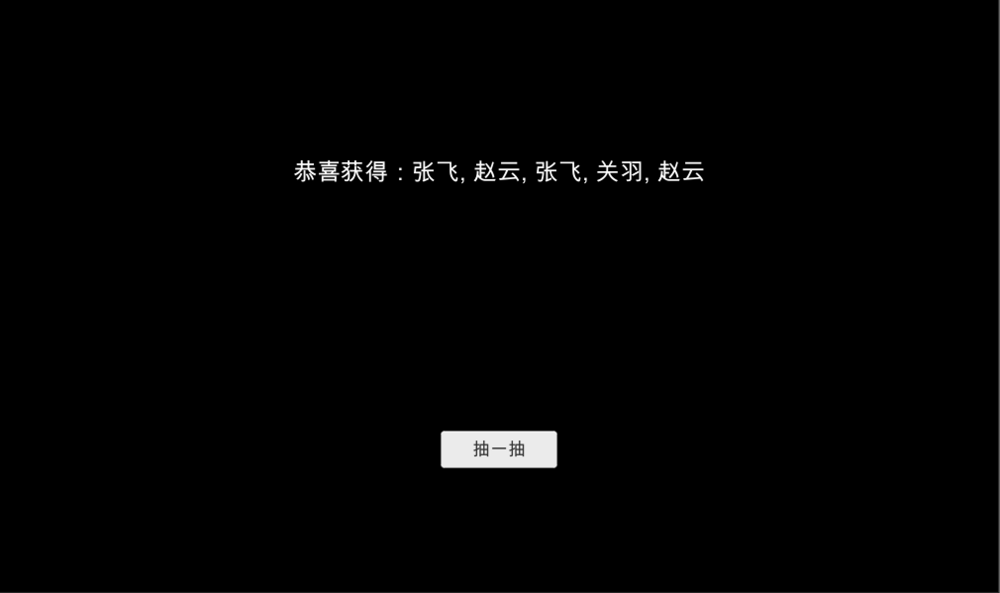

## 云引擎

云引擎（LeanEngine）是 LeanCloud 推出的服务端托管平台。[详情](https://leancloud.cn/docs/leanengine_overview.html)。

在游戏开发中，我们可以利用云引擎做一些「数据敏感」操作，如「抽卡」。

Demo 中展示了游戏中常见的「抽卡」功能，其他一些需要服务端验证的功能也可以通过云引擎实现。

通过 lean-cli 我们可以初始化 LeanCloud App 的云引擎工程，[详情](https://leancloud.cn/docs/leanengine_cli.html)。

在云函数中，我们可以检测用户的请求是否合法，如账号是否有足够的金币，是否超过最大次数限制等。

这里我们只用一个简单的云函数展示「抽卡」功能：

```javascript
/**
 * 模拟抽卡请求
 */
AV.Cloud.define("draw", function (request) {
  const heros = [
    "刘备",
    "关羽",
    "张飞",
    "赵云",
    "黄忠",
    "曹操",
    "孙权",
    "夏侯惇",
    "周瑜",
    "董卓",
  ];
  const result = [];
  while (result.length < 5) {
    const random = Math.floor(Math.random() * heros.length);
    heros.slice(random, 1);
    result.push(heros[random]);
  }
  return result;
});
```

对应客户端的调用也很简单：

```csharp
try {
    Dictionary<string, object> results = await LCCloud.Run("draw");
    List<object> heros = results["result"] as List<object>;
    string info = $"恭喜获得：{string.Join(", ", heros)}";
    resultText.text = info;
    Debug.Log(info);
} catch (Exception e) {
    Debug.LogError(e);
}
```

LeanCloud 云函数支持返回 JSON 格式或 LCObject 类型的数据。


