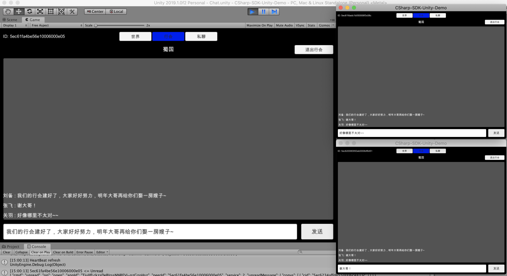

## 行会/组队频道




游戏中为了建立自己的势力，或者共同完成某个任务，通常会有创建行会或者组队的需求。与之对应的就是**群聊**对话，群聊一般有如下特点：

- 人数有上限
- 关心群聊成员的增减
- 允许 @ 成员
- 可能关心聊天记录
- 可能关心离线消息

创建行会对话，这里需要注意的是，为了避免对话唯一（即相同的用户可以创建不同的对话），需要将 unique 字段设置为 false

```csharp
try {
    LCIMConversation conversation = await Realtime.Client.CreateConversation(new string[] { },
        name: name,
        unique: false,
        properties: new Dictionary<string, object> {
            { "gang", true }
        });
    Debug.Log($"conversation: {conversation.Id}");
    SendMessageUpwards("OnCreateOrJoinGang", conversation);
} catch (LCException e) {
    Debug.LogError($"{e.Code} - {e.Message}");
}
```

查找行会对话，这里为了不引入更多概念，只在行会对话属性中加入了 gang = true

```csharp
LCIMConversationQuery query = new LCIMConversationQuery(Realtime.Client);
query.WhereEqualTo("gang", true);
ReadOnlyCollection<LCIMConversation> gangConversations = await query.Find();
foreach (LCIMConversation gangConv in gangConversations) {
    GangItem gangItem = Instantiate(gangItemPrefab);
    gangItem.nameText.text = gangConv.Name;
    gangItem.OnJoin = async () => {
        try {
            // 加入行会对话
            await gangConv.Join();
            SendMessageUpwards("OnCreateOrJoinGang", gangConv);
        } catch (LCException e) {
            Debug.LogError($"{e.Code} - {e.Message}");
        }
    };
    gangItem.transform.SetParent(contentObject.transform);
}
```

退出行会对话

```csharp
try {
    await gangConversation.Quit();
    SendMessageUpwards("OnQuitGang");
} catch (LCException e) {
    Debug.LogError($"{e.Code} - {e.Message}");
}
```

发送消息

```csharp
LCIMTextMessage message = new LCIMTextMessage(text);
await gangConversation.Send(message);
chatScrollView.AddMessage(message);
```

接收消息

```csharp
private void OnMessage(LCIMConversation conversation, LCIMMessage message) {
    if (gangConversation.Id == conversation.Id &&
        message is LCIMTextMessage textMessage) {
        _ = conversation.Read();
        chatScrollView.AddMessage(textMessage);
    }
}
```
