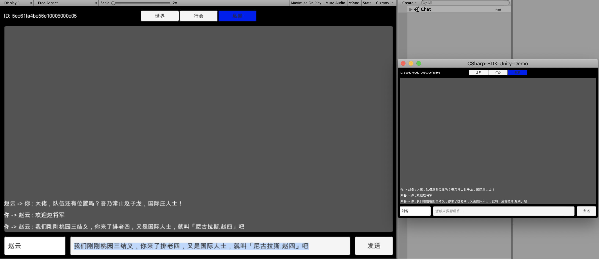

## 私聊



游戏中的**私聊**一般定义为两个玩家之间互发消息。私聊的聊天记录很重要，有时需要提供查看功能。

在 LeanCloud 服务中，私聊就是一种只包含两个用户的对话，需要注意的是，这个对话对于聊天双方来说是唯一的，也就是说只包含 A，B 用户的对话应该是唯一的。

```csharp
// 创建对话时，unique 参数默认为 true，也就是说无论什么时候创建的只包含 A，B 用户的对话，都是唯一的
conv = await Realtime.Client.CreateConversation(new string[] { clientId });
```

发送消息

```csharp
try {
    LCIMTextMessage message = new LCIMTextMessage(text);
    LCIMMessageSendOptions options = new LCIMMessageSendOptions {
        Receipt = true
    };
    await conv.Send(message, options);
    Debug.Log($"{message.Id} sent sucessfully");
    chatScrollView.AddPrivateMessage(Realtime.Client.Id, clientId, message);
} catch (LCException e) {
    Debug.LogError($"{e.Code}, {e.Message}");
}
```

对于普通对话，我们支持追踪消息的状态，消息状态包括：

- 发送成功，即服务器收到了发送者的消息请求，并确认
- 接收成功，即服务器将消息投递到了接收方，并确认
- 已读标记，即接收方将消息标记为已读

```csharp
private void OnMessage(LCIMConversation conversation, LCIMMessage message) {
    // 这里只是简单的判断对话的成员数量 = 2 为私聊，并不严谨
    if (conversation.MemberIds.Count == 2 &&
        message is LCIMTextMessage textMessage) {
        _ = conversation.Read();
        chatScrollView.AddPrivateMessage(message.FromClientId, Realtime.Client.Id, textMessage);
    }
}
```

[代码参考](https://github.com/leancloud/CSharp-SDK-Unity-Demo/blob/master/Assets/Realtime/PrivateChatPanel.cs)
