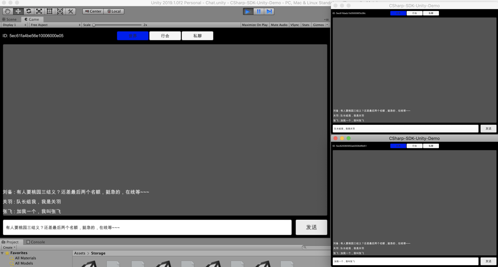

## 世界频道



游戏中的**世界频道**一般定义为包含全体玩家的聊天室，聊天室有如下特点：

- 人数多
- 不关心对话成员的增减
- 不关心聊天记录
- 不关心离线消息

但是一般情况下，世界频道是预先创建好的，玩家在登录后，直接加入到这个对话（聊天室）中即可。

在 Demo 中，我们预先创建了一个名为 **World 的聊天室类型的对话**，玩家在登录后，可以查找到这个对话后加入即可。

```csharp
LCIMConversationQuery query = new LCIMConversationQuery(Realtime.Client);
// tr = true 表示暂态对话条件，即聊天室类型
query.WhereEqualTo("tr", true)
    .WhereEqualTo("name", "World");
chatRoom = (await query.Find()).First() as LCIMChatRoom;
try {
    await chatRoom.Join();
    Realtime.Client.OnMessage += OnMessage;
} catch (LCException e) {
    Debug.LogError($"{e.Code}, {e.Message}");
}
```

发送消息

```csharp
LCIMTextMessage message = new LCIMTextMessage(text);
await chatRoom.Send(message);
chatScrollView.AddMessage(message);
```

在接收到消息的事件回调里，我们可以根据条件来展示到 UI

```csharp
private void OnMessage(LCIMConversation conversation, LCIMMessage message) {
    // 这里判断是否是聊天室类型的对话，并且是文本消息
    if (conversation is LCIMChatRoom &&
        message is LCIMTextMessage textMessage) {
        chatScrollView.AddMessage(textMessage);
    }
}
```

[代码参考](https://github.com/leancloud/CSharp-SDK-Unity-Demo/blob/master/Assets/Realtime/WorldChatPanel.cs)
