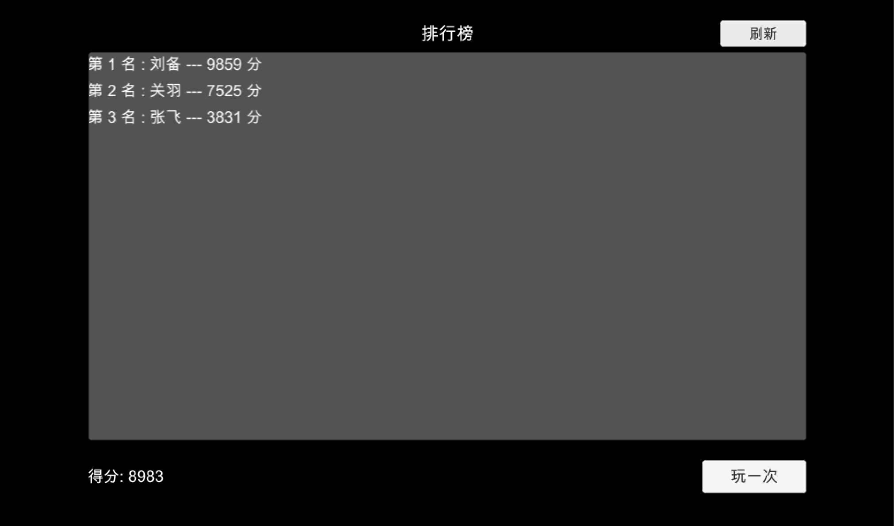

## 排行榜

**排行榜**是游戏中常见的功能，通常包括玩家游戏分数，英雄战斗力等。

Demo 中我们模拟了排行榜列表，以及玩家成绩更新的场景



查询排行榜排名

```csharp
try {
    LCLeaderboard leaderboard = LCLeaderboard.CreateWithoutData(LEADERBOARD_NAME);
    ReadOnlyCollection<LCRanking> rankings = await leaderboard.GetResults(limit: 10,
        selectUserKeys: new string[] { "hero" });
    for (int i = 0; i < rankings.Count; i++) {
        LCRanking ranking = rankings[i];
        Hero hero = ranking.User["hero"] as Hero;
        Text rankingText = Instantiate(rankingTextPrefab);
        rankingText.text = $"第 {i + 1} 名 : {hero.Name} --- {Convert.ToInt32(ranking.Value)} 分";
        rankingText.transform.SetParent(contentObject.transform);
    }
} catch (LCException e) {
    Debug.LogError(e);
}
```

更新玩家成绩

```csharp
try {
    LCUser currentUser = await LCUser.GetCurrent();
    Dictionary<string, double> statistic = new Dictionary<string, double> {
        { LEADERBOARD_NAME, score }
    };
    await LCLeaderboard.UpdateStatistics(currentUser, statistic, overwrite: false);
} catch (LCException e) {
    Debug.LogError(e);
}
```

[参考代码](https://github.com/leancloud/CSharp-SDK-Unity-Demo/blob/master/Assets/Leaderboard/LeaderboardScene.cs)
