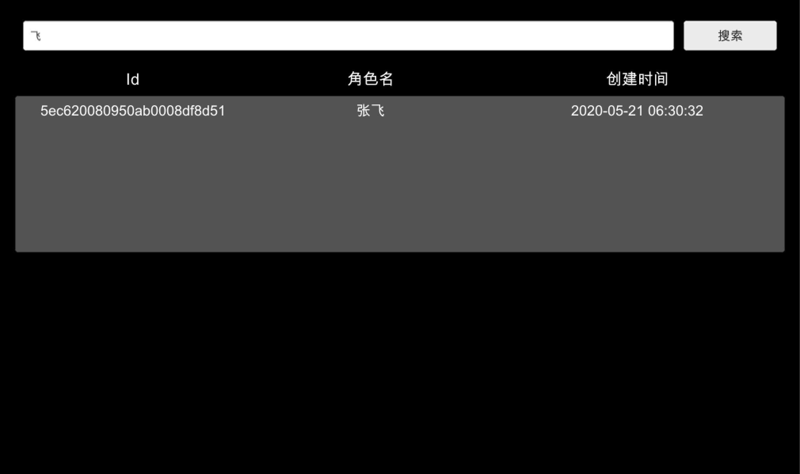

## 查询



游戏中经常有查询的场景，比如：

- 根据 id 查询装备信息
- 根据等级范围查询玩家信息
- ...

Demo 中以角色名查询角色信息为例

```csharp
LCQuery<Hero> query = new LCQuery<Hero>("Hero");
query.WhereContains("name", name);
ReadOnlyCollection<Hero> heros = await query.Find();
```

[代码参考](https://github.com/leancloud/CSharp-SDK-Unity-Demo/blob/master/Assets/Storage/QueryScene.cs)
